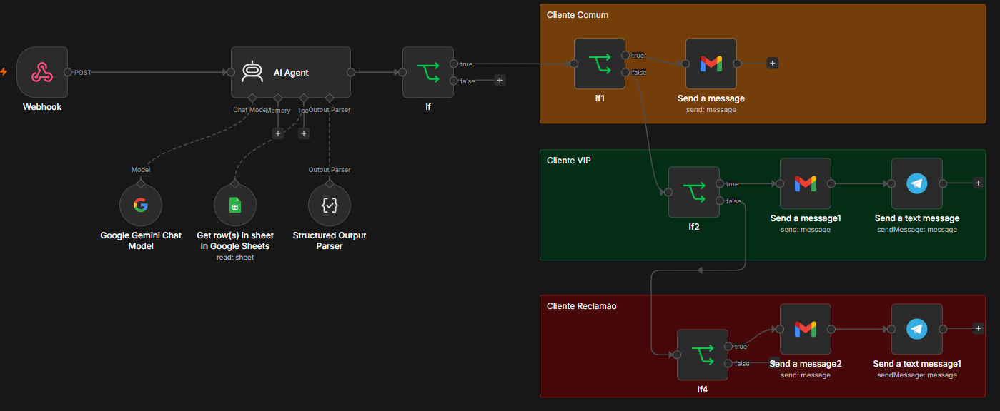
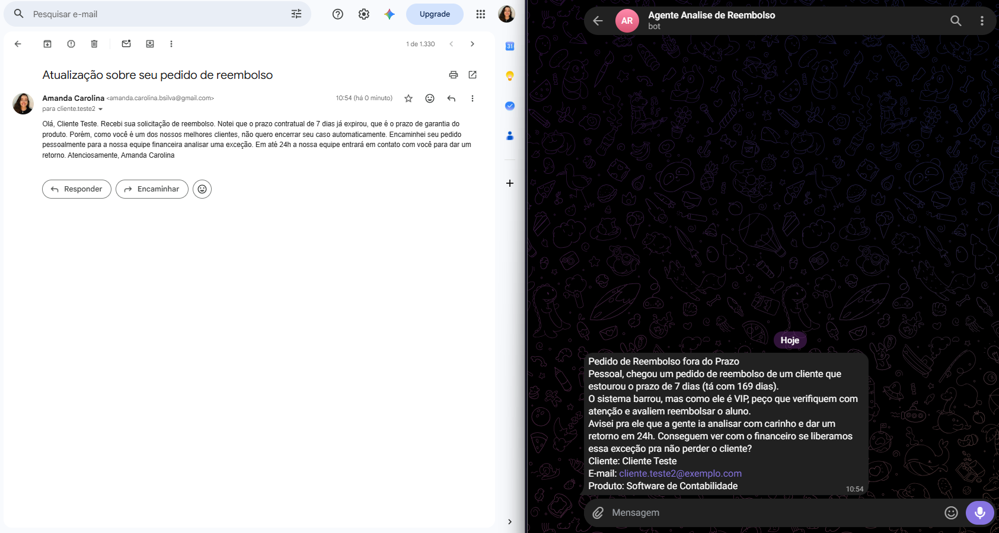
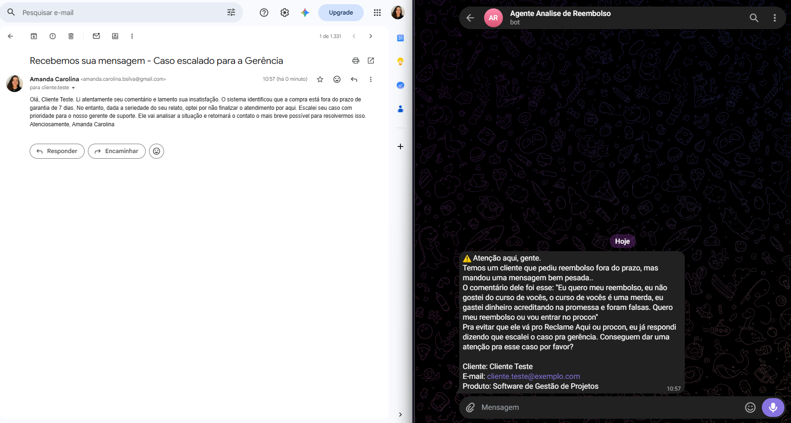

# 💸 Agente de Análise de Reembolso

Agente de IA para automatizar o processo de solicitação de reembolso de uma empresa de venda de cursos online. O sistema classifica o cliente e a solicitação, e decide automaticamente como responder — por e-mail e/ou alertando a equipe via Telegram.

Terceiro projeto da série de estudos com n8n, após o [Chat Básico](../chat-basico) e o [Assistente de Estudos via WhatsApp](../assistente-whatsapp-estudos) — aqui o foco passa de "conversas" para automação de um **processo de decisão de negócio real**.

## 🧰 Tecnologias utilizadas

`n8n` · `Google Gemini (LLM)` · `Tally (formulário)` · `Google Sheets` · `Gmail` · `Telegram`

## 📋 Contexto de negócio

A empresa vende cursos nas seguintes áreas:
- Software de Contabilidade
- Software de Gestão de Projetos
- Software de Edição de Vídeo
- Plataforma de Criação de Sites
- Plataforma de CRM de Vendas

**Regra de reembolso:** o cliente tem direito a reembolso em até **7 dias** após a compra. Passado esse prazo, ele perde o direito — mas, na prática, clientes insatisfeitos costumam solicitar reembolso mesmo fora do prazo, tentando reaver o dinheiro. Este agente automatiza a triagem desses casos **posteriores aos 7 dias** (casos dentro do prazo já recebem reembolso normalmente, sem passar por este fluxo).

## 🧠 Como o agente decide

O processo é dividido em duas etapas: **extração/análise** (feita pela IA) e **decisão** (feita pela lógica condicional do workflow).

### Etapa 1 — O AI Agent extrai e estrutura os dados

O agente **não decide** se o reembolso será aprovado ou não. Sua única função é ler a resposta do formulário e os dados da planilha "base clientes", retornando um JSON estruturado com:

- Dados do formulário: nome, e-mail, produto, comentário
- **Análise de sentimento** do comentário (`positivo`, `neutro`, `negativo`, `muito_negativo`)
- Dados da planilha: se o cliente foi encontrado, nome completo e total gasto
- **Dias desde a última compra**, calculado a partir da data da planilha e da data atual

A análise de sentimento segue critérios objetivos (ex: `muito_negativo` = agressividade, xingamentos, ameaças de Procon/Reclame Aqui/processo/CAPS LOCK) e, em caso de dúvida entre `negativo` e `muito_negativo`, o prompt instrui o agente a ser conservador e escolher `negativo`.

### Etapa 2 — A lógica condicional (nodes If) decide e direciona

Com os dados estruturados, o workflow classifica e direciona a solicitação:

| Classificação | Critério | Ação tomada |
|---|---|---|
| **Cliente Comum** | Fora do prazo de 7 dias, não é VIP, sentimento não é `muito_negativo` | Resposta automática por e-mail informando que o reembolso não é possível (prazo expirado). Não aciona a equipe. |
| **Cliente VIP** | Total histórico de compras acima de **R$ 3.000** | E-mail avisando que o caso foi encaminhado para análise + alerta no grupo do Telegram para o time avaliar uma exceção com o financeiro |
| **Cliente Problemático** | Sentimento classificado como `muito_negativo` | E-mail avisando que o caso foi escalado para a gerência + alerta de prioridade no Telegram, para evitar reclamação pública (Reclame Aqui/Procon) |

## 🛠️ Arquitetura do workflow

| Node | Função |
|---|---|
| **Webhook** | Recebe a resposta do formulário de reembolso (Tally) |
| **AI Agent** | Classifica o cliente/solicitação com base nas regras de negócio |
| **Google Gemini Chat Model** | Modelo de linguagem usado pelo agente |
| **Get row(s) in sheet** | Busca o histórico do cliente na planilha "base clientes" |
| **Structured Output Parser** | Garante que a resposta da IA venha em um formato estruturado e previsível |
| **If / If1 / If2 / If4** | Direcionam o fluxo conforme a classificação do cliente |
| **Send a message (Gmail)** | Envia a resposta por e-mail ao cliente |
| **Send a text message (Telegram)** | Notifica a equipe interna em grupo dedicado à análise de reembolsos |

## 💬 Templates de mensagem

### Telegram (equipe interna)

O grupo do Telegram recebe uma notificação apenas nos casos **VIP** e **Problemático** — clientes comuns são resolvidos automaticamente por e-mail, sem necessidade de intervenção do time.

**VIP:**
> Pedido de Reembolso fora do Prazo
> Pessoal, chegou um pedido de reembolso de um cliente que estourou o prazo de 7 dias (tá com X dias).
> O sistema barrou, mas como ele é VIP, peço que verifiquem com atenção e avaliem reembolsar o aluno.
> Avisei pra ele que a gente ia analisar com carinho e dar um retorno em 24h. Conseguem ver com o financeiro se liberamos essa exceção pra não perder o cliente?
> Cliente: [nome] | E-mail: [email] | Produto: [produto]

**Reclamão:**
> ⚠️ Atenção aqui, gente.
> Temos um cliente que pediu reembolso fora do prazo, mas mandou uma mensagem bem pesada.
> Pra evitar que ele vá pro Reclame Aqui ou Procon, eu já respondi dizendo que escalei o caso pra gerência. Conseguem dar uma atenção pra esse caso por favor?
> Cliente: [nome] | E-mail: [email] | Produto: [produto]

### E-mail (resposta ao cliente)

**Cenário 1 — Cliente Comum (rejeição padrão):**
> Assunto: Retorno sobre sua solicitação de reembolso
>
> Verifiquei aqui que a compra foi efetuada há mais de 7 dias. Como o prazo de garantia incondicional é de 7 dias corridos, infelizmente não conseguiremos prosseguir com o reembolso.

**Cenário 2 — Cliente VIP:**
> Assunto: Atualização sobre seu pedido de reembolso
>
> Notei que o prazo contratual de 7 dias já expirou. Porém, como você é um dos nossos melhores clientes, encaminhei seu pedido pessoalmente para a nossa equipe financeira analisar uma exceção. Em até 24h retornaremos com uma resposta.

**Cenário 3 — Sentimento Muito Negativo:**
> Assunto: Recebemos sua mensagem - Caso escalado para a Gerência
>
> O sistema identificou que a compra está fora do prazo de garantia. No entanto, dada a seriedade do seu relato, optei por não finalizar o atendimento por aqui e escalei seu caso com prioridade para o nosso gerente de suporte.

*(Templates completos disponíveis no workflow — os e-mails usam o nome do cliente dinamicamente via variável.)*

## 🤖 Prompt do AI Agent (resumo)

O prompt segue um passo a passo rígido: (1) extrai os campos do formulário, (2) busca o cliente na planilha usando o e-mail normalizado como chave única — nunca inventando dados, (3) calcula os dias desde a última compra a partir de `{{ $now }}` e da data na planilha, (4) analisa o sentimento do comentário, e (5) retorna **apenas um JSON cru** (sem markdown), seguindo um schema fixo. Essa rigidez no formato de saída é o que permite ao **Structured Output Parser** validar a resposta antes de seguir para a lógica condicional.

## 📝 Formulário de entrada

O formulário de solicitação de reembolso foi criado no **Tally**: [https://tally.so/r/rjbQWo](https://tally.so/r/rjbQWo)

## 📸 Prints do workflow

**Estrutura do workflow no n8n:**

**Simulação — Cliente Comum (fora do prazo, resposta automática):**

**Simulação — Cliente VIP (exceção aberta, time notificado):**

**Simulação — Cliente Problemático (caso escalado, time alertado com urgência):**

## 💡 O que aprendi neste projeto

- Como estruturar um agente de IA para tomar decisões de negócio (não só responder perguntas)
- Uso de **Structured Output Parser** para obter respostas confiáveis e no formato esperado
- Integração de múltiplos canais de resposta (e-mail + Telegram) a partir de uma única lógica de decisão
- Como usar dados históricos de uma planilha para enriquecer a decisão da IA (classificação de cliente VIP)
- Importância de escrever prompts claros o suficiente para não deixar brechas de interpretação em regras de negócio sensíveis (como critérios de reembolso)

## ⚠️ Sobre segurança e privacidade

Este workflow lida com **dados reais de clientes** (nome, e-mail, histórico de compras). O `.json` publicado neste repositório contém **placeholders genéricos** no lugar de credenciais, IDs de planilha, e identificadores de grupo do Telegram. Nenhum dado real de cliente está incluído nos prints ou exemplos deste repositório.

## 🚀 Como usar

1. Importe o arquivo `workflow.json` desta pasta no seu n8n (**Menu → Import from File**)
2. Configure suas próprias credenciais (Google Gemini, Google Sheets, Gmail, Telegram)
3. Ajuste o link do formulário Tally (ou substitua por outro formulário de sua preferência)
4. Adapte os critérios de classificação (ex: valor de corte para cliente VIP) conforme a realidade do seu negócio

---

*Projeto de estudo desenvolvido com n8n, aplicando IA a um processo real de decisão de negócio. Veja também: [Assistente de Estudos via WhatsApp](../assistente-whatsapp-estudos).*
