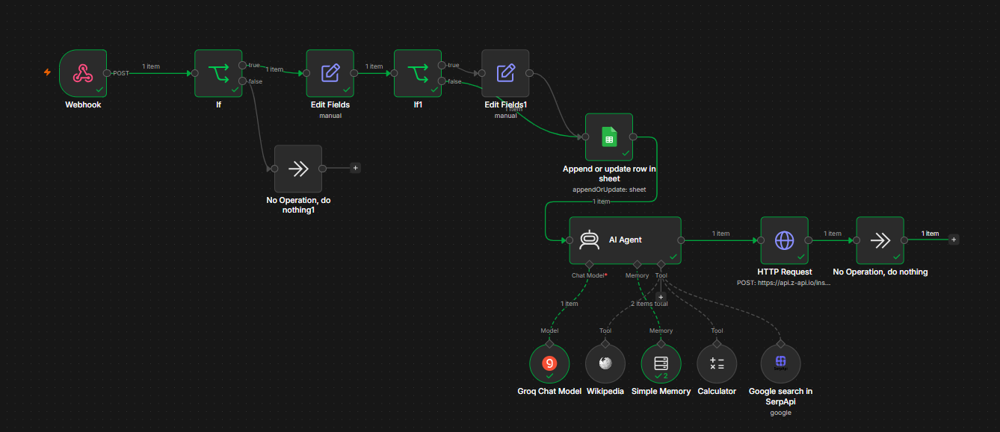
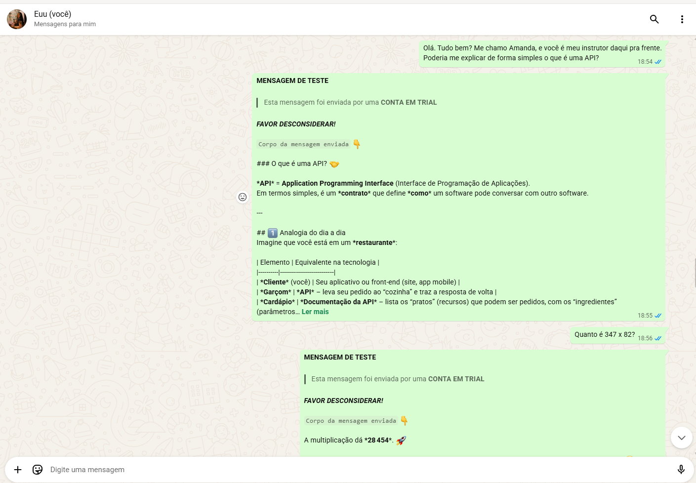
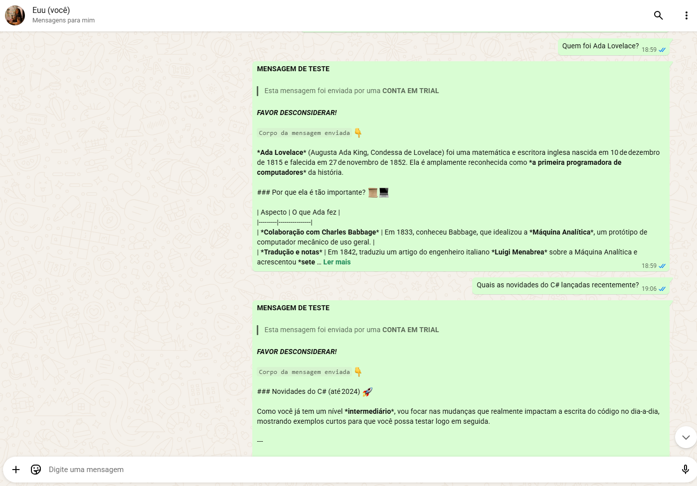
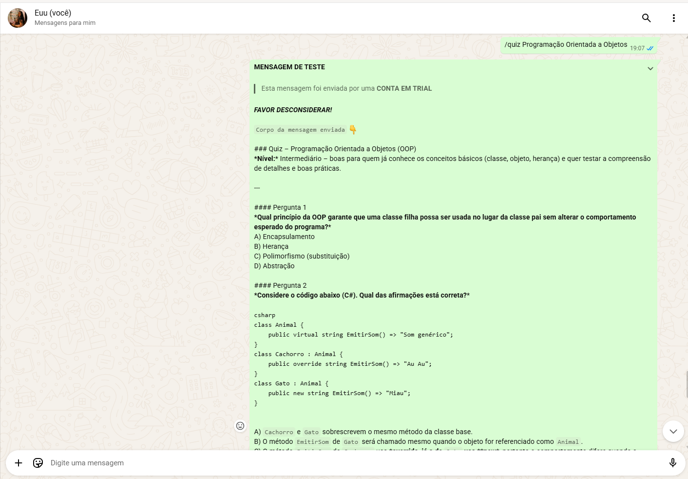
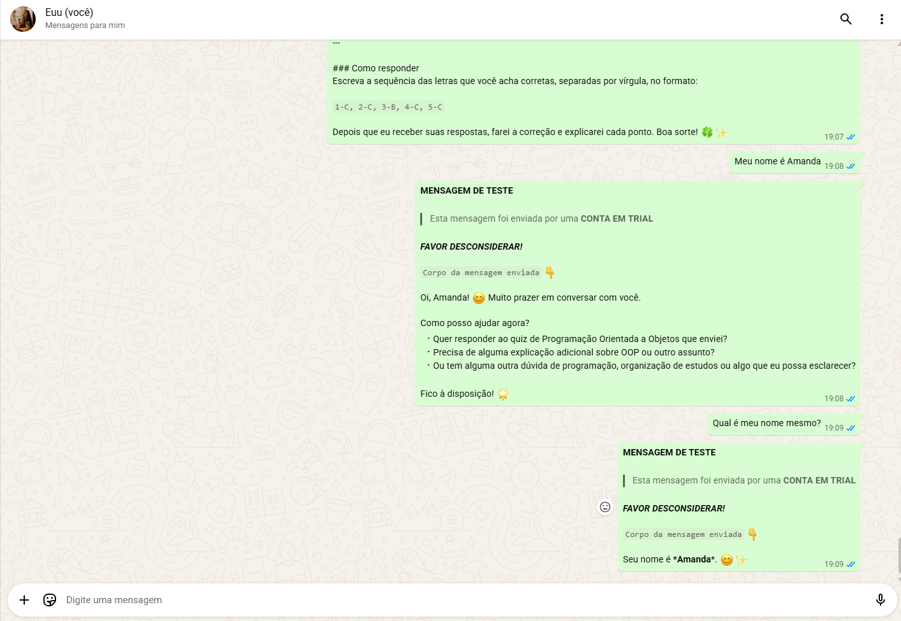

# 🤖📱 Assistente de Estudos via WhatsApp (n8n + IA)

Agente de inteligência artificial integrado ao WhatsApp, criado para atuar como um assistente pessoal de estudos, dúvidas, cursos e treinamentos. Evolução do [Chat Básico](../chat-basico), meu primeiro projeto com n8n — agora com integração real via WhatsApp (Z-API), comandos personalizados e múltiplas ferramentas de busca.

## 🧰 Tecnologias utilizadas

`n8n` · `Groq (LLM)` · `WhatsApp (Z-API)` · `Google Sheets` · `SerpApi` · `LangChain Tools (Calculator, Wikipedia)`

## 📋 O que o agente faz

- Recebe mensagens diretamente do **WhatsApp** através da **Z-API**
- Responde dúvidas de estudos, cursos, programação e conceitos gerais
- Mantém **memória da conversa**, lembrando o contexto entre mensagens
- Registra o histórico de conversas em uma planilha do **Google Sheets**
- Possui um **comando especial `/quiz [tema]`**, que gera automaticamente um quiz de múltipla escolha sobre qualquer assunto
- Usa múltiplas ferramentas para enriquecer as respostas:
  - 🧮 **Calculator** — cálculos matemáticos
  - 📚 **Wikipedia** — conceitos, definições e fatos
  - 🌐 **SerpApi (Google Search)** — busca de informações atuais na web

## 🛠️ Arquitetura do workflow

| Node | Função |
|---|---|
| **Webhook** | Recebe as mensagens enviadas pela Z-API |
| **If** | Validação inicial da mensagem recebida |
| **Edit Fields** | Organiza os dados (ID da conversa, mensagem, nome) |
| **If1** | Verifica se a mensagem é um comando `/quiz` |
| **Edit Fields1** | Monta o prompt especial para gerar o quiz, quando aplicável |
| **Append or update row in sheet** | Salva a conversa no Google Sheets |
| **AI Agent** | Orquestra o raciocínio, decide quais ferramentas usar |
| **Groq Chat Model** | Modelo de linguagem (openai/gpt-oss-120b via Groq) |
| **Simple Memory** | Mantém o histórico da conversa por sessão |
| **Calculator / Wikipedia / SerpApi** | Ferramentas disponíveis para o agente |
| **HTTP Request** | Envia a resposta de volta ao WhatsApp via Z-API |

## 🧠 Lógica do comando `/quiz`

Quando a mensagem começa com `/quiz [tema]`, o fluxo desvia para um caminho especial que:
1. Remove o comando e extrai o tema da mensagem
2. Monta um prompt instruindo a IA a gerar diretamente uma pergunta de múltipla escolha (sem pedir esclarecimentos antes)
3. Envia esse prompt para o AI Agent, que responde com a pergunta formatada (alternativas A/B/C/D + gabarito)

Mensagens que não começam com `/quiz` seguem o fluxo normal de conversa.

## 📸 Prints do workflow e da conversa

**Estrutura do workflow no n8n:**

**Conversa real com o assistente — conceitos, cálculos e explicações:**

**Buscando conceitos (Wikipedia) e informações atuais (SerpApi):**

**Comando especial `/quiz` gerando perguntas sobre Programação Orientada a Objetos:**

**Teste de memória — o assistente lembra o contexto da conversa:**

## 💡 O que aprendi neste projeto

- Diferença entre **URL de teste** e **URL de produção** em Webhooks do n8n
- Como integrar o n8n com uma API externa de WhatsApp (Z-API)
- Como usar o node **If** para criar lógica condicional e comandos especiais dentro de um agente de IA
- Ajustar o **System Message** de um agente para modular seu comportamento e prioridades
- A importância de **nunca publicar credenciais, tokens ou IDs de instância reais** em repositórios públicos

## ⚠️ Sobre segurança

Este repositório contém o workflow com **placeholders genéricos** no lugar de credenciais reais (IDs de planilha, Instance ID e Token da Z-API, etc.). Para usar este workflow, substitua os placeholders pelos seus próprios dados nas respectivas plataformas.

## ⚙️ Limitações conhecidas

- Contas gratuitas/trial da **Z-API** inserem um aviso automático ("Mensagem de teste") em todas as mensagens enviadas — isso é uma característica da plataforma, não um erro do workflow.
- O plano gratuito da **Groq** possui limite de requisições por minuto/dia. Em uso intenso de testes, o node "AI Agent" pode retornar erro de *rate limit* temporariamente.

## 🚀 Como usar

1. Importe o arquivo `workflow.json` desta pasta no seu n8n (**Menu → Import from File**)
2. Configure suas próprias credenciais (Groq, Google Sheets, SerpApi)
3. Configure sua instância da Z-API e substitua o Instance ID/Token no node HTTP Request
4. Publique o workflow para receber e responder mensagens automaticamente

---

*Projeto de estudo desenvolvido com n8n, integrando IA generativa e automação de WhatsApp. Veja também: [Chat Básico](../chat-basico) — o projeto que deu origem a este.*
