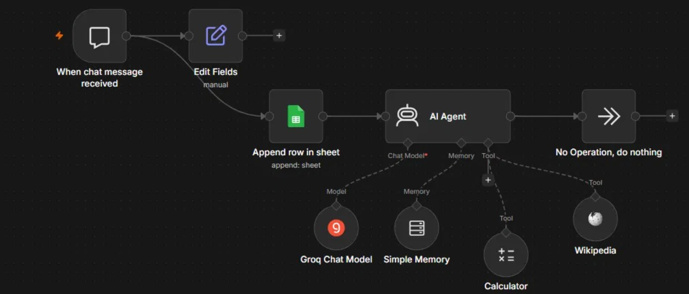
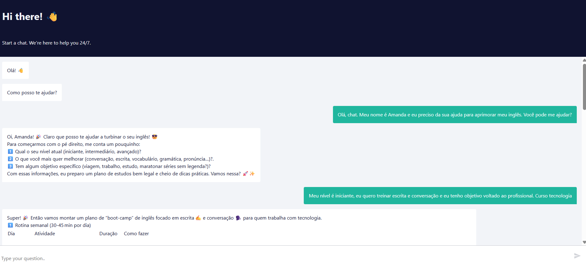

# 🤖 Chat Básico — Agente de IA no n8n

Meu primeiro projeto de automação usando **n8n** para criar um agente de chat com inteligência artificial. O objetivo foi aprender na prática como funcionam agentes de IA, integração com ferramentas externas (tools) e memória de conversa.

## 🧰 Tecnologias utilizadas

`n8n` · `Groq (LLM)` · `Google Sheets` · `LangChain Tools (Calculator, Wikipedia)`

## 📋 O que o agente faz

- Recebe mensagens através de um **chat web** (trigger "When chat message received")
- Registra cada conversa em uma **planilha do Google Sheets** (ID da conversa + mensagem)
- Processa a mensagem usando um **AI Agent**, que decide se precisa usar alguma ferramenta ou responder diretamente
- Mantém o **histórico da conversa** (memória), lembrando informações mencionadas anteriormente na mesma sessão
- Pode usar ferramentas externas quando necessário:
  - 🧮 **Calculator** — para cálculos matemáticos
  - 📚 **Wikipedia** — para buscar informações enciclopédicas

## 🛠️ Nodes utilizados

| Node | Função |
|---|---|
| **When chat message received** | Gatilho que inicia o fluxo ao receber uma mensagem |
| **Edit Fields** | Organiza os dados da mensagem recebida |
| **Append row in sheet** | Salva a conversa no Google Sheets |
| **AI Agent** | Node principal, orquestra o raciocínio e as ferramentas |
| **Chat Model (Groq)** | Modelo de linguagem que gera as respostas |
| **Simple Memory** | Guarda o histórico da conversa por sessão |
| **Calculator** | Ferramenta para operações matemáticas |
| **Wikipedia** | Ferramenta para buscas enciclopédicas |

## 🧠 Escolha do modelo de IA

Utilizei o **Groq** como provedor do modelo de linguagem. Durante o desenvolvimento, testei três opções e documentei o motivo da escolha final:

| Modelo testado | Resultado |
|---|---|
| `groq/compound` | ❌ Não compatível com tool calling customizado (ferramentas próprias conectadas ao AI Agent) |
| `llama-3.3-70b-versatile` | ⚠️ Funcionou, mas foi descontinuado pela Groq |
| `openai/gpt-oss-120b` | ✅ Modelo final escolhido — suporte completo a tool calling |

## 📸 Prints do workflow

**Estrutura do workflow no n8n:**

**Exemplo de conversa com o agente:**

## 💡 O que aprendi

- Como estruturar um AI Agent no n8n conectando Model, Memory e Tools
- A diferença entre modelos "puros" de linguagem e modelos agentes prontos (como o Compound)
- Que nem todo modelo de IA suporta "tool calling" — e a importância de verificar isso antes de montar o fluxo
- Como debugar erros no n8n usando a aba de **Executions**
- Boas práticas de segurança: nunca publicar credenciais, IDs de planilha ou tokens reais em repositórios públicos

## 🚀 Como usar

1. Importe o arquivo `.json` desta pasta no seu n8n (**Menu → Import from File**)
2. Configure suas próprias credenciais (Groq, Google Sheets)
3. Ative o workflow e clique em **"Open chat"** para testar

---

*Projeto de estudo desenvolvido com n8n. Veja também: [Assistente de Estudos via WhatsApp](../assistente-whatsapp-estudos) — a evolução deste projeto.*
